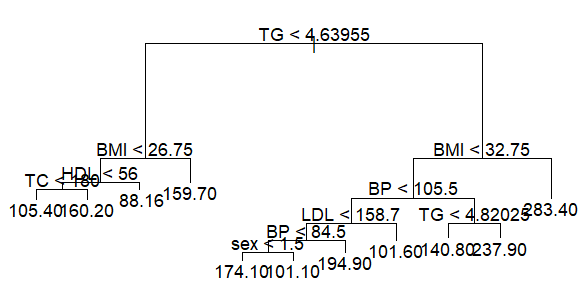
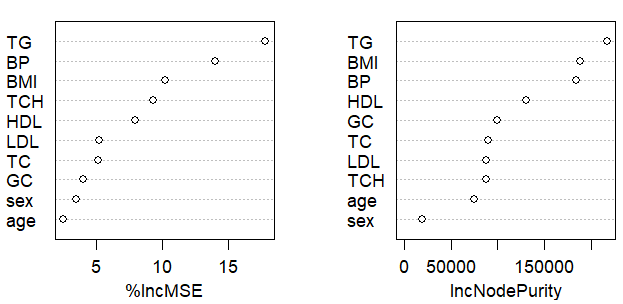

```{r setup, include=FALSE}
knitr::opts_chunk$set(warning=FALSE,message=FALSE,tidy.opts=list(width.cutoff = 65),tidy = TRUE)
```

\thispagestyle{empty}
\addtocounter{page}{-1}



# Introduction

In this paper, we will investigate the association between disease progression after 1 year from a baseline(stored in variable $progr$) on 442 diabetic patients. The dataset used contains the following variables:

| Variable name | Explanation                               |
|:-------------:|-------------------------------------------|
|     $age$     | Age of patients                           |
|     $sex$     | Sex of patients                           |
|     $BMI$     | Body mass index                           |
|     $BP$      | average blood pressure \[mmHg\]           |
|     $TC$      | total cholesterol \[mg/dl\]               |
|     $LDL$     | low-density lipoproteins \[mg/dl\]        |
|     $HDL$     | high-density lipoproteins \[mg/dl\]       |
|     $TCH$     | ratio between total cholesterol and $HDL$ |
|     $TG$      | triglycerides level \[mg/dl, log-scaled\] |
|     $GC$      | blood glucose \[mg/dl\]                   |

### Data exploration

In order to have a visual sense of our dataset, we can plot each variable and see their distributions.

```{r fig.height=3.7, fig.cap="Variable Distribution", fig.alig="center"}
#| echo: false
# Load Dataset
library(readr)
dataf <- read_delim("db.txt",delim = "\t", escape_double = FALSE, trim_ws = TRUE)

library(tidyverse)
dataf %>%
    select(where(is.numeric)) %>%
    pivot_longer(cols = everything(), names_to = "Variable", values_to = "Value") %>%
    ggplot(aes(x = Value)) +
    geom_histogram(bins = 30, fill = "skyblue") +
    facet_wrap(~ Variable, scales = "free") +
    labs(y= "Count", x="")+
    theme_minimal()
```

From the following box-plot we can have a better look at outliers. Note that there are some, which may represent patients with severe health conditions. We chose to not remove them as they real and important cases and are able to bring valuable information. However, it is important to acknowledge their influence on the models.

```{r, fig.height=2, fig.cap="Variable boxplot", fig.alig="center"}
#| echo: false
# Boxplots for numeric variables
dataf %>%
  select(where(is.numeric)) %>%
  pivot_longer(cols = everything(), names_to = "Variable", values_to = "Value") %>%
  ggplot(aes(x = Variable, y = Value)) +
  geom_boxplot(fill = "lightblue") +
  theme_minimal() +
  labs(title = "Boxplots for Numeric Variables")
```

And by looking at the correlation matrix between the predictors, we can note that in general, there are two pairs of predictors that are highly correlated $TC$-$LDL$ at $0.897$ and $TCH$-$LDL$ at $0.660$. These predictors could affect the interpretability of the decision tree model, while random forests and gradient boosting models will be more unaffected due to their robust structure. The predictors with higher correlation to $progr$ are, in order: $BMI$ ($0.586$), $TG$ ($0.566$), $BP$ ($0.441$) and $TCH$ ($0.430$), and is likely they will play a significant role in the models.

```{r, fig.width=3, fig.height=3, fig.cap="Correlation Matrix", fig.alig="center"}
#| echo: false
# Correlation matrix
cor_matrix <- cor(dataf, use = "complete.obs")
# Visualize the correlation matrix
library(corrplot)
corrplot(cor_matrix, method = "color", type = "upper", tl.col = "black", tl.srt = 45, tl.cex = 0.7)
```

### Preprocessing

```{r}
set.seed(1)

# Split Training and Testing. 50/50 split
train_idx <- sample(seq_len(nrow(dataf)), size = 0.5 * nrow(dataf))
train_df <- dataf[train_idx, ]
test_df  <- dataf[-train_idx, ]

# Define function to compute Mean Squared Error (MSE)
compute_mse <- function(preds, truth) {
    mean((preds - truth)^2)
}
```

# Analysis plan

### Tree based methods used

In this paper, we will use three different regression models for predicting disease progression.

1.  **Cost-complexity pruned decision tree**: this model is simple and interpretable, allowing non-specialized people to understand the reasoning of the outcome. This model has only one hyper-parameter that needs to be tuned, the number of trees and we will use cross-validation in order to find it;

2.  **Random Forest**: this model is less prone to overfitting compared to the decision tree as it averages predictions from multiple results, and is able to capture more complex interactions between the predictors. This model requires the tuning of two hyper-parameters: the number of predictors selected at each split and the number of trees. In order to find these, we implemented a grid search and found the one with the lowest Mean Squared Error;

3.  **Gradient Boosting**: this model builds tree sequentially and so is able to correct the error of the previous ones. This too can find complex interactions between the predictors. However, it requires the tuning of three hyper-parameters: the number of trees used, the depth of each tree and the learning rate. Similarly to the random forest, we will use a grid search to tune these parameters.

### How to compare models fairly

To compare the models fairly we decided to apply the same evaluation metric to all models, the Mean Squared Error (MSE).

Furthermore, in order to avoid data leakage to our model, we split the data into two equal-sized sets: the training and testing. For models that required grid-searching, the training set was split into two subsets, a training one (with 80% size of the original one) and a validation one (20% the size).

# Cost-complexity Pruned Decision Tree

### Model complexity

Lets now fit a Cost-complexity pruned decision tree on our training dataset. Firstly, the unpruned tree was first trained on the training set and then cross-validation was applied to determine the optimal number of terminal nodes. The plot below shows the relationship between the tree size and the deviance.

```{r fig.cap="Deviance vs Tree Size", fig.align='center', fig.height=3}
#| echo: false
library(tree)
set.seed(1)
tree.train <- tree(progr ~ ., data = train_df)
yhat <- predict(tree.train, newdata=test_df)
cv.train <- cv.tree(tree.train)
plot(cv.train$size, cv.train$dev, type = "b", xlab = "Tree Size", ylab = "Deviance")
```

The optimal size was found to be 11. We can now visualize the pruned tree

```{r fig.cap="Pruned Decision Tree", fig.align='center', fig.height=4}
#| echo: false
set.seed(1)
tree.pruned <- prune.tree(tree.train, best = 11)
```

{fig-align="center" width="428"}

### Performance

The MSE of the pruned tree is of $4072.281$, while the unpruned tree's MSE is of $4519.935$. This is a significant improvement, however it is still quite high.

### Interpretation

The pruned tree shows how the important predictors are the same found during the data exploration phase which are: $TG$, $BMI$ and $BP$.

# Random Forest

### Model complexity

In order to select the complexity of the Random Forest model, as stated, we need to tune two hyper-parameters, the number of predictors selected at each split ($mtry$)and the number of trees ($ntree$). To do so, we implemented a grid search of values ranging from 1 to the total number of parameters for $mtry$, while for $ntree$ the range went from 50 to 500 in increments of 50. To avoid data leakage, the training set was split into two subset, the training (80%) and the validation (20%) on which the trained model was evaluated. The optimal hyper-parameters were chosen according to the lowest validation MSE.

```{r}
#| echo: false
library(rsample)
ntree_grid <- seq(50, 500, by = 50)
mtry_grid <- seq(1, ncol(train_df) - 1, by = 1) 
best_mse <- Inf
best_ntree <- NULL
best_mtry <- NULL

train_split <- initial_split(train_df, prop = 0.8)  # 80-20 split
train_data <- training(train_split)
validation_data <- testing(train_split)
```

```{r}
library(randomForest)
for (ntree in ntree_grid) {
    for (mtry in mtry_grid) {
        set.seed(1)
        bag.train <- randomForest(progr ~ ., data = train_data, mtry = mtry, ntree = ntree, importance = TRUE)
        bag.pred <- predict(bag.train, newdata = validation_data)
        mse <- compute_mse(bag.pred, validation_data$progr)
        if (mse < best_mse) {
            best_mse <- mse
            best_ntree <- ntree
            best_mtry <- mtry
        }
    }
}
```

This grid search found the optimal values to be $mtry=2$ and $ntree=300$.

### Performance

The following plot shows the Out-Of-Bag (OOB) error in relation to the number of trees. We can note how it stabilizes after 50 trees, this indicates how adding more trees after this point does not greatly improve performance. However we chose to keep the best value found by the grid search as it is more robust thanks to the reliability of the OOB error. In the plot, the blue line indicates where the OOB error stabilizes (at around 50 trees), while the red line is the optimal number of trees found.

```{r  fig.cap="OOB Error vs Number of Trees", fig.height=3, echo=FALSE, results='hide',fig.keep='all'}
#| echo: false
set.seed(1)
rf <- randomForest(progr ~ ., data = train_df, mtry = 2, ntree = 500, importance = TRUE)
plot(rf$mse, type = "l", xlab = "Number of Trees", ylab = "OOB Error (MSE)")+
    abline(v = 300, col = "red", lty = 2)+
    abline(v = 50, col = "blue", lty = 2)
```

This model achieved a final MSE equal to $3228.501$.

### Interpretation

From this model, we can note how the most important predictors were: $TG$ (with $17,80\%$ increase of MSE and a $217479.12$ increase in node purity), $BMI$ (with increases of $10.20\%$ and $188144.23$) and $BP$ (with $13,96\%$ and $184220.86$). This also aligns with what we found during the data exploration phase.

```{r}
#| echo: false
set.seed(1)
bag.train <- randomForest(progr ~ ., data=train_df, mtry=best_mtry, importance=TRUE, ntree=best_ntree)
```

{fig-align="center" width="468"}

# Gradient Boosting Model

### Model complexity

As stated, in order to tune the hyper-parameters of the Gradient Boosting model, we used grid search. There are three hyper-parameters: the number of boosting iterations ($n.trees$), the depth of each tree ($interaction.depth$) and the learning rate ($shrinkage$). We performed the grid search as follows:

```{r}
#| echo: false
n_trees_grid <- c(1000, 2000, 3000, 5000)
interaction_depth_grid <- c(2, 4, 6)
shrinkage_grid <- c(0.01, 0.1, 0.2)

# Initialize variables to store the best results
best_mse <- Inf
best_ntree <- NULL
best_depth <- NULL
best_shrinkage <- NULL

# Manual grid search
set.seed(1)
train_split <- initial_split(train_df, prop = 0.8)  # 80-20 split
train_data <- training(train_split)
validation_data <- testing(train_split)

```

```{r}
library(gbm)
for (n_trees in n_trees_grid) {
    for (interaction_depth in interaction_depth_grid) {
        for (shrinkage in shrinkage_grid) {
            set.seed(1)
            boosted <- gbm(progr ~ ., data = train_data, 
                           distribution = "gaussian",
                           n.trees = n_trees, 
                           interaction.depth = interaction_depth,
                           shrinkage = shrinkage, 
                           verbose = FALSE)
            yhat <- predict(boosted, newdata = validation_data, n.trees = n_trees)
            mse <- compute_mse(yhat, validation_data$progr)
            
            if (mse < best_mse) {
                best_mse <- mse
                best_ntree <- n_trees
                best_depth <- interaction_depth
                best_shrinkage <- shrinkage
            }
        }
    }
}
```

This grid search found the optimal values to be $n\_trees=1000$, $interaction\_depth=2$ and $shrinkage=0.01$.

### Performance

By training the gradient boosting model with the optimal hyper-parameters, we obtain that the MSE is of $3146.24$, which is our best performing model. This is thanks to the ability of the gradient boosting being able to capture more complex relationships.

### Interpretation

Unsurprisingly, the most important predictors are once again: $TG$, $BMI$ and $BP$.

```{r  fig.cap="Predictor Importance in Gradient Boosting Model", fig.align='center', fig.height=3}
#| echo: false
library(gbm)

set.seed(1)
boosted <- gbm(progr ~ ., data = train_df, distribution = "gaussian",
               n.trees = best_ntree, interaction.depth = best_depth, shrinkage = best_shrinkage, verbose = FALSE)

var_importance <- summary(boosted, plotit = FALSE)

library(ggplot2)
ggplot(var_importance, aes(x = reorder(var, rel.inf), y = rel.inf, fill = rel.inf)) +
  geom_bar(stat = "identity", show.legend = FALSE) +
  coord_flip() +
  labs(x = "Predictors",
       y = "Relative Influence (%)") +
  scale_fill_gradient(low = "skyblue", high = "blue") +
  theme_minimal()
```

# Model Comparison

The tree models were compared, as stated during the analysis plan, by a fixed training-test split with an additional split for the Random Forest and Gradient Boosting one, and cross-validation for the decision tree, in order to best tune model complexity. Reoptimizing the hyper-parameters for each model is crucial as the optimal complexity level depends on the data used. Not doing so, could benefit some models while penalizing others.

In terms of performance, the Gradient Boosting model achieved the lowest error($MSE=3146.24$), followed by the Random Forest, with a MSE equal to $3228.501$ and, lastly, the Decision Tree model with a MSE of $4072.281$. This is not surprising as this improvement follows the increase in complexity of the models. Despite these differences, however, they were all able to identify the same predictors as the most important ones: $TG$, $BMI$ and $BP$. This fact reinforce the idea that these variables do have a role in the progress of diabetes in patients.

These models, however, have different levels of explainability. The Decision tree provides the most, while the Gradient boosting provides the least. This should be a factor that is kept in mind while choosing which model to use. Since explainability is an important aspect in the medical field, one could consider more highly the Decision Tree model despite its higher error.

# Conclusion

The results show how the Gradient Boosting model outperforms other tree-based models on this dataset, however the difference compared to the Random Forest model is almost negligible (around $80$ MSE units), with this second option being more interpretable and less computationally expensive. However, both these models outperform the simple Decision Tree model by about $900$ MSE units; this indicates how incorporating multiple trees provides a meaningful performance increase. Nonetheless all models found the same three predictors as the most important ones, signalizing how these predictors are both drivers of the disease progression and important signals to look out for.

However, this dataset has some limitations, as there are only 442 observations which have an impact on how generalized the models can be. Lastly, there are some highly correlated predictors which may affect interpretability.

Future works should concentrate their effort on improving the robustness of the results and the depth of the analysis, such as implementing k-fold cross validation on all the models and to asses the model interpretability more formally, as this is a vital part in the medical field.
